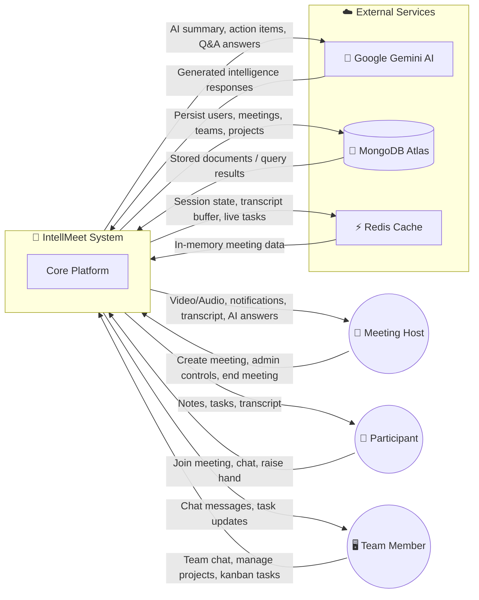
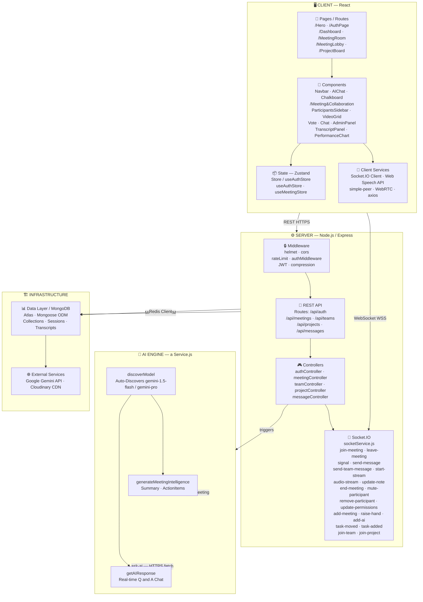

<div align="center">

# 🤖 IntellMeet: AI-Powered Enterprise Meeting Platform

### *Transforming conversations into actionable insights.*

[](https://github.com/syedsadikaslam/IntellMeet-AI-Powered-Enterprise-Meeting-Collaboration-Platform)
[](https://mongodb.com)
[](https://openai.com)
[](LICENSE)

[**Explore Documentation**](#-table-of-contents) • [**Quick Start**](#-quick-start) • [**Architecture**](#-architecture) • [**API Reference**](#-api-reference)

</div>

---

## 🚀 Overview

**IntellMeet** is a next-generation enterprise collaboration platform that leverages artificial intelligence to automate meeting overhead. By combining real-time video conferencing with advanced NLP, IntellMeet ensures that no action item is lost and every meeting results in tangible progress.

> [!IMPORTANT]
> **IntellMeet reduces post-meeting administrative tasks by up to 60%** by automating transcription, summarization, and task delegation.

---

## ✨ Core Features

| Feature | Description |
| :--- | :--- |
| **🎥 High-Perf Video** | WebRTC-powered low-latency video and audio rooms supporting 50+ participants. |
| **🧠 AI Meeting Intelligence** | Real-time transcription using OpenAI Whisper and intelligent summarization via GPT-4. |
| **📋 Smart Action Items** | Automatic extraction of tasks from meeting dialogue with assignee detection. |
| **🏢 Team Dashboard** | Centralized management of meetings, teams, and project-linked collaboration tools. |
| **👤 Enterprise Profiles** | Simplified, professional profile management optimized for corporate environments. |
| **💬 Project-Linked Chat** | Real-time messaging with full historical context and file sharing. |
| **📊 Productivity Analytics** | Insights into meeting frequency, engagement metrics, and task completion rates. |


---

## 🛠 Tech Stack

### **Frontend Architecture**
- **Framework**: React 19 + Vite (for blazing fast HMR)
- **Language**: TypeScript (Type-safe codebase)
- **Styling**: Tailwind CSS v4 + shadcn/ui (Premium Glassmorphism)
- **State Management**: TanStack Query (Server State) + Zustand (Client State)
- **Communication**: Socket.io-client + WebRTC

### **Backend Core**
- **Runtime**: Node.js + Express
- **Database**: MongoDB (Primary) + Redis (Session & Live State)
- **Real-time**: Socket.io (Bi-directional events)
- **Auth**: JWT with Refresh Token Rotation + bcrypt
- **Storage**: Cloudinary (Assets/Recordings)

---

## 🏗 Architecture & System Design

The platform follows a distributed, service-oriented architecture built for high availability, real-time collaboration, and AI-driven intelligence. Below are the design diagrams that describe the system at different levels of abstraction.

---

### 1️⃣ System Context Diagram



---

### 2️⃣ Low-Level Design (LLD) — Component Architecture



---

## 📁 Project Structure

```text
IntellMeet/
├── client/                 # React 19 Frontend
│   ├── src/components/     # Modular UI Components (Navbar, Sidebars)
│   ├── src/pages/          # Routing & Views (Dashboard, Profile, Meeting)
│   ├── src/store/          # Zustand State Models
│   └── src/utils/          # API & Socket Config
├── server/                 # Node.js Backend (Production Hardened)
│   ├── controllers/        # Business Logic
│   ├── models/             # Mongoose Schemas
│   ├── routes/             # API Endpoints
│   ├── services/           # Socket & AI Integration
│   └── utils/              # Redis & Auth Helpers
├── assets/                 # Documentation Media
├── k8s/                    # Kubernetes Deployment Manifests
└── charts/                 # Helm Charts for Orchestration
```

---

## 🚀 Quick Start

### 1. Installation
```bash
git clone https://github.com/syedsadikaslam/IntellMeet-AI-Powered-Enterprise-Meeting-Collaboration-Platform.git
cd IntellMeet-AI-Powered-Enterprise-Meeting-Collaboration-Platform
```

### 2. Environment Setup
Create a `.env` file in the `server` directory.

### 3. Launching (Development)
```bash
# Terminal 1: Backend
cd server
npm install
npm run dev

# Terminal 2: Frontend
cd client
npm install
npm run dev
```

### 4. Launching (Production)
```bash
# Build the frontend
cd client
npm install
npm run build

# Start the server (Backend will serve the frontend automatically)
cd ../server
npm install
npm start
```

---

## 🔐 Environment Variables

### Server (`/server/.env`)
| Key | Description |
| :--- | :--- |
| `MONGO_URI` | MongoDB connection string |
| `JWT_SECRET` | Primary signing key for tokens |
| `REDIS_HOST` | Redis instance host |
| `FRONTEND_URL` | Production domain (for CORS) |
| `NODE_ENV` | Set to `production` for live deployment |

---

## 🛡 Security & Performance

- **Production Hardened**: Integrated `helmet.js` for security, `compression` for Gzip payloads, and `morgan` for request logging.
- **Static Asset Serving**: Automatically serves the React `dist` folder in production, enabling single-instance deployment.
- **Rate Limiting**: Brute-force protection on all authentication routes.
- **Data Integrity**: Full Zod schema validation on frontend and Mongoose validation on backend.

---

<div align="center">
  <p>Built with ❤️ by <b>Sadik</b></p>
  <p><i>A Zidio Development Strategic Project · 2026</i></p>
</div>
