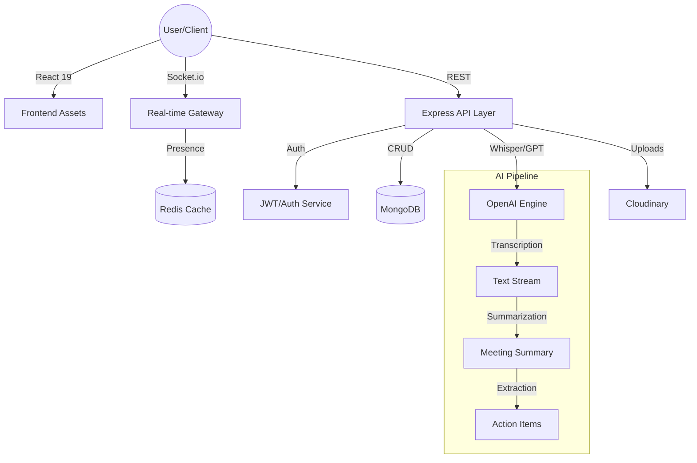

<div align="center">

# 🤖 IntellMeet: AI-Powered Enterprise Meeting Platform

### *Transforming conversations into actionable insights.*

[](https://github.com/syedsadikaslam/IntellMeet-AI-Powered-Enterprise-Meeting-Collaboration-Platform)
[](https://mongodb.com)
[](https://openai.com)
[](LICENSE)

[**Explore Documentation**](#-table-of-contents) • [**Quick Start**](#-quick-start) • [**Architecture**](#-architecture) • [**API Reference**](#-api-reference)

</div>

---

## 🚀 Overview

**IntellMeet** is a next-generation enterprise collaboration platform that leverages artificial intelligence to automate meeting overhead. By combining real-time video conferencing with advanced NLP, IntellMeet ensures that no action item is lost and every meeting results in tangible progress.

> [!IMPORTANT]
> **IntellMeet reduces post-meeting administrative tasks by up to 60%** by automating transcription, summarization, and task delegation.

---

## ✨ Core Features

| Feature | Description |
| :--- | :--- |
| **🎥 High-Perf Video** | WebRTC-powered low-latency video and audio rooms supporting 50+ participants. |
| **🧠 AI Meeting Intelligence** | Real-time transcription using OpenAI Whisper and intelligent summarization via GPT-4. |
| **📋 Smart Action Items** | Automatic extraction of tasks from meeting dialogue with assignee detection. |
| **🏢 Team Workspaces** | Dedicated environments for departments or projects with nested Kanban boards. |
| **💬 Project-Linked Chat** | Real-time messaging with full historical context and file sharing. |
| **📊 Productivity Analytics** | Insights into meeting frequency, engagement metrics, and task completion rates. |


---

## 🛠 Tech Stack

### **Frontend Architecture**
- **Framework**: React 19 + Vite (for blazing fast HMR)
- **Language**: TypeScript (Type-safe codebase)
- **Styling**: Tailwind CSS v4 + shadcn/ui (Premium Glassmorphism)
- **State Management**: TanStack Query (Server State) + Zustand (Client State)
- **Communication**: Socket.io-client + WebRTC

### **Backend Core**
- **Runtime**: Node.js + Express
- **Database**: MongoDB (Primary) + Redis (Session & Live State)
- **Real-time**: Socket.io (Bi-directional events)
- **Auth**: JWT with Refresh Token Rotation + bcrypt
- **Storage**: Cloudinary (Assets/Recordings)

---

## 🏗 Architecture

The platform follows a distributed service-oriented architecture designed for high availability and low latency.



---

## 📁 Project Structure

```text
IntellMeet/
├── client/                 # React 19 Frontend
│   ├── src/components/     # Modular UI Components
│   ├── src/pages/          # Routing & Views
│   ├── src/store/          # Zustand State Models
│   └── src/utils/          # API & Socket Config
├── server/                 # Node.js Backend
│   ├── controllers/        # Business Logic
│   ├── models/             # Mongoose Schemas
│   ├── routes/             # API Endpoints
│   ├── services/           # Socket & AI Integration
│   └── utils/              # Redis & Auth Helpers
├── assets/                 # Documentation Media
├── k8s/                    # Kubernetes Deployment Manifests
└── charts/                 # Helm Charts for Orchestration
```

---

## 🚀 Quick Start

### Prerequisites
- Node.js (v18+)
- Docker (optional for local deployment)
- API Keys for OpenAI & Cloudinary

### 1. Installation
```bash
git clone https://github.com/syedsadikaslam/IntellMeet-AI-Powered-Enterprise-Meeting-Collaboration-Platform.git
cd IntellMeet-AI-Powered-Enterprise-Meeting-Collaboration-Platform
```

### 2. Environment Setup
Create a `.env` file in the `server` directory based on the reference below.

### 3. Launching Locally
```bash
# Terminal 1: Backend
cd server
npm install
npm run dev

# Terminal 2: Frontend
cd client
npm install
npm run dev
```

---

## 🔐 Environment Variables

### Server (`/server/.env`)
| Key | Description |
| :--- | :--- |
| `MONGO_URI` | MongoDB connection string |
| `JWT_SECRET` | Primary signing key for tokens |
| `REDIS_URL` | Redis instance URL |
| `OPEN_AI_KEY` | OpenAI API access |
| `CLOUDINARY_URL` | Media storage credentials |

---

## 📡 API Reference

### **Authentication**
- `POST /api/auth/register` - Create a new account
- `POST /api/auth/login` - Authenticate and return tokens
- `POST /api/auth/refresh` - Rotate access tokens

### **Meetings**
- `POST /api/meetings` - Initialize a new meeting room
- `GET /api/meetings/:id` - Fetch meeting metadata and summary
- `POST /api/meetings/join` - Validate and join via code

### **Workspaces & Tasks**
- `GET /api/teams` - List all joined workspaces
- `POST /api/projects/:id/tasks` - Create task from AI action items

---

## 🛡 Security & Performance

- **Production Hardened**: Helmet.js for security headers and Gzip for payload compression.
- **Monitoring**: Integrated Sentry for error tracking and Prometheus for performance metrics.
- **Rate Limiting**: Brute-force protection on all authentication routes.
- **Data Integrity**: Full Zod schema validation on frontend and Mongoose validation on backend.

---

## 📅 Roadmap

- [x] **Phase 1**: Real-time video/chat foundation.
- [x] **Phase 2**: AI Summary Engine integration.
- [x] **Phase 3**: Docker & Kubernetes orchestration.
- [/] **Phase 4**: Advanced Analytics & Engagement reports.
- [ ] **Phase 5**: Mobile PWA & Offline Support.

---

## 🤝 Contributing

We welcome contributions! Please refer to our [Contributing Guidelines](CONTRIBUTING.md) for details on our code of conduct and the process for submitting pull requests.

---

<div align="center">
  <p>Built with ❤️ by <b>Sadik</b></p>
  <p><i>A Zidio Development Strategic Project · 2026</i></p>
  <p>
    <a href="https://github.com/syedsadikaslam/IntellMeet-AI-Powered-Enterprise-Meeting-Collaboration-Platform/issues">Report Bug</a> · 
    <a href="https://github.com/syedsadikaslam/IntellMeet-AI-Powered-Enterprise-Meeting-Collaboration-Platform/issues">Request Feature</a>
  </p>
</div>
